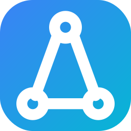

<<<<<<< HEAD
# SkillGap-AI
Bridge Your Skill Gap &amp; Land Your Dream Job
=======
# SkillGap AI 🚀 — Bridge Your Skill Gap, Land Your Dream Job

SkillGap AI is a **production-ready, high-level, full-stack web application** designed to help tech professionals transition into new roles. By using AI to analyze a user's current technical skills against predefined industry roles, it highlights critical skill gaps and mathematically generates a personalized learning roadmap.

This project focuses on **modern UI/UX aesthetics**, robust data flow, and a highly scalable code architecture to look and perform like a real-world SaaS platform.



---

## ✨ Core Features

1. **AI-Powered Skill Analysis Engine**
   - Evaluates user skills against **14+ top industry roles** (Cloud Architect, Full Stack, Data Scientist, Cybersecurity, AI Engineer, etc.).
   - Employs sets/arrays mapping logic to instantly spot overlapping expertise and missing critical skills.
   - **NEW: Resume Parsing**: Support for PDF resume extraction to automatically identify current skills.

2. **Personalized Dashboard & Roadmap**
   - **Competency Radar Chart**: Visualizes your strengths across required dimensions using Recharts.
   - **Interactive Learning Roadmap**: Auto-generates an actionable plan with direct links to curated resources from YouTube, Coursera, and Udemy.
   - **Mark as Complete**: Track your progress in real-time; completing a roadmap item instantly updates your dashboard stats and charts.

3. **Integrated AI Career Assistant (Chatbot)**
   - **Gemini 1.5 Flash Integration**: Context-aware chatbot powered by Google’s latest AI for career guidance.
   - Helps suggest personalized projects, interview tips, and learning paths.
   - Features "Quick Prompts", typing indicators, and markdown rendering.

4. **Premium Multi-Theme UI**
   - **Dark Glass (Default)**: Modern, high-contrast abyss blue aesthetic.
   - **White Mode**: Clean, high-clarity professional light theme.
   - Fully animated with `Framer Motion` for smooth micro-interactions.

---

## 🛠️ Tech Stack

### **Frontend**
- **React.js 18 & Vite**: Blazing fast HMR and optimized builds.
- **Tailwind CSS**: Utility-first styling with advanced design tokens.
- **Framer Motion**: Premium animations and layout transitions.
- **Recharts**: Dynamic data visualization for skill mapping.

### **Backend**
- **FastAPI**: Modern, high-performance Python web framework.
- **Google Generative AI**: Gemini 1.5 SDK for intelligent career assistance.
- **PyMuPDF**: Robust PDF parsing for resume analysis.
- **Uvicorn**: Asynchronous server handling.

---

## 🚀 Getting Started

### Prerequisites
- **Node.js**: v18+
- **Python**: v3.8+
- **Gemini API Key**: (Optional) Get it from [Google AI Studio](https://aistudio.google.com/) for the chatbot.

### 1. Installation
```bash
# Clone the repository
git clone <your-repo-url>
cd SkillGap
```

### 2. Backend Setup
```bash
cd backend

# Create and activate virtual environment
python -m venv venv
# Windows:
venv\Scripts\activate
# Mac/Linux:
source venv/bin/activate

# Install dependencies
pip install -r requirements.txt

# Configure Environment (Optional but recommended)
# Create a .env file and add:
# GEMINI_API_KEY=your_key_here

# Start the API server
uvicorn main:app --reload
```
*Backend runs on: `http://localhost:8000`*

### 3. Frontend Setup
```bash
# In a new terminal tab
cd frontend

# Install packages
npm install

# Start development server
npm run dev
```
*Frontend runs on: `http://localhost:5173`*

---

## 🎨 System Architecture

```text
SkillGap/
├── backend/                       # FastAPI Application
│   ├── main.py                    # API Entry Point & Middleware
│   ├── routes/                    # API Endpoints (Analysis, Chat, Auth)
│   ├── services/                  # PDF Parsing & AI logic
│   └── requirements.txt           # Python packages
├── frontend/                      # React / Vite Application
│   ├── src/
│   │   ├── components/            # Navbar, Chatbot, ThemeToggle
│   │   ├── pages/                 # Home, Analysis, Dashboard
│   │   ├── index.css              # Design tokens & Global styles
│   │   └── App.jsx                # Routing & Theme management
│   └── vite.config.js             # Proxy configuration
```

---

*SkillGap AI — Designed for growth, built for success.*
└── Dashboard.jsx      # Recharts viz & roadmap pipeline
```

---

*SkillGap AI was developed to demonstrate full-stack mastery, scalable state-management, fluid animations, and robust backend data processing.*
>>>>>>> 341249a (Initial commit: Full-stack SkillGap AI Project)
